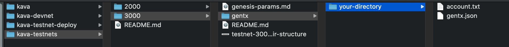

# Testnet 3000

## Overview
Kava testnet-3000 will test the functionality of the Kava blockchain prior to deployment of mainnet. If no bugs are found, this version of [Kava](https://www.github.com/kava-labs/kava) will be the same as the version used on mainnet. If you are planning on running a validator on mainnet, it is **strongly** recommended that you participate in testnet-3000.

## Joining
To join testnet-3000 as a validator, you should submit both a **genesis transaction** and an **account addresss**. The genesis transaction will be for your validator and the account address will control vesting coins that can be delegated. Coins held by the account address will be in a new account type called a [Validator Vesting Account](https://github.com/Kava-Labs/kava/blob/master/x/validator-vesting/spec/01_concepts.md), which vests the coins over time based on whether or not your validator participates in consensus. For testnet-3000, coins will be released every ~12 hours if the validator has signed 90% or greater pre-commits.

 Since this is new functionality, we encourage participants to test regular account actions like delegating/undelegating coins, sending coins, and taking your validator offline. If you suspect you have found a bug, file an issue in the [Kava repo](https://www.github.com/kava-labs/kava/issues) or post it in the [riot chat](https://riot.im/app/#/room/#kava-validators:matrix.org)

1. Install Kava

**Requires Go 1.13+**

```sh
git clone https://github.com/kava-labs/kava
git checkout v0.3.0-rc1
make install
kvd init --chain-id=kava-testnet-3000 <moniker>
```

`kvd version --long` should output:

```sh
name: kava
server_name: kvd
client_name: kvcli
version: 0.3.0-rc1
commit: 247ccc288678da0d30b24a4589164eecbcd031ed
build_tags: netgo,ledger
go: go version go1.13 darwin/amd64
```

2. Create a gentx for your validator

```sh
kvcli keys add <validator>
kvd add-genesis-account $(kvcli keys show validator -a) 50000000ukava
kvd gentx --name <validator> --amount 50000000ukava
```

3. Create your account address and save it to a text file.

```sh
kvcli keys add <account>
kvcli keys show <account> -a > <account>.txt
```

4. Submit your gentx and account address as a PR.

First, fork https://github.com/kava-labs/kava-testnets to your `$HOME` directory.

```sh
cd $HOME/kava-testnets
# Make a directory for your gentx
mkdir ./3000/gentx/<your directory>
cp $HOME/.kvd/config/gentx/gentx-* $HOME/kava-testnets/3000/gentx/<your directory>/.
cp $HOME/kava/<account>.txt $HOME/kava-testnets/3000/gentx/<your director>/.
```

The structure of your PR should look like 

Push the changes to github and submit a PR at the [kava-testnets](https://github.com/kava-labs/kava-testnets) repo.

For general troubleshooting, please use the [riot chat](https://riot.im/app/#/room/#kava-validators:matrix.org).

Warning: The documentation for the kava blockchain is incomplete as it's still early in the development roadmap. Due to this, becoming a validator currently requires familiarity with the cosmos-sdk, as well as managing and deploying production IT systems.
